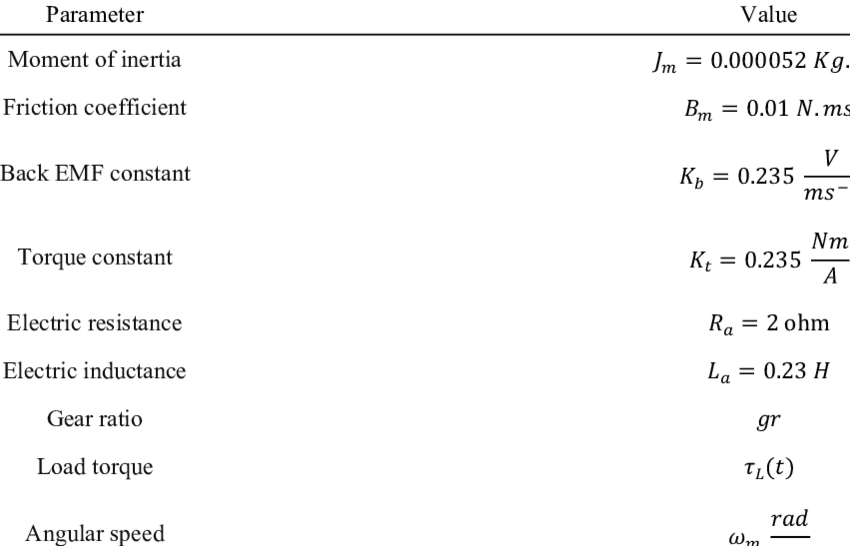
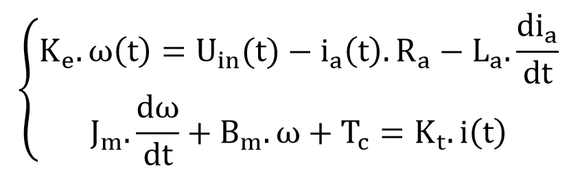
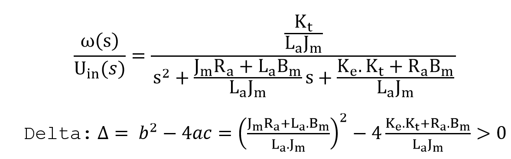
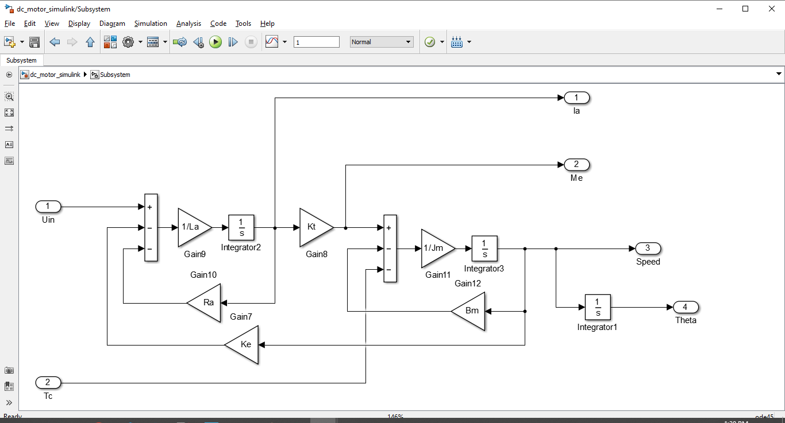
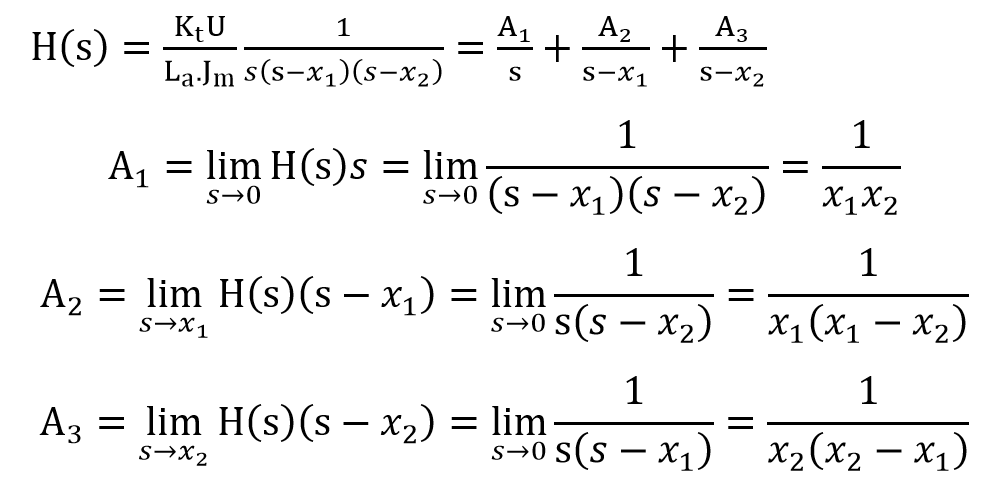
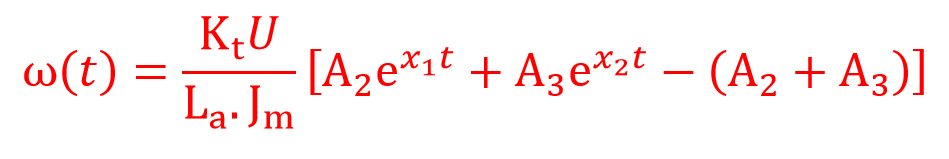
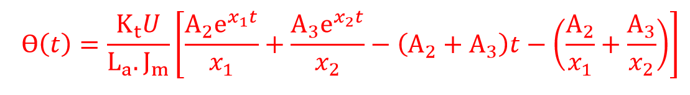
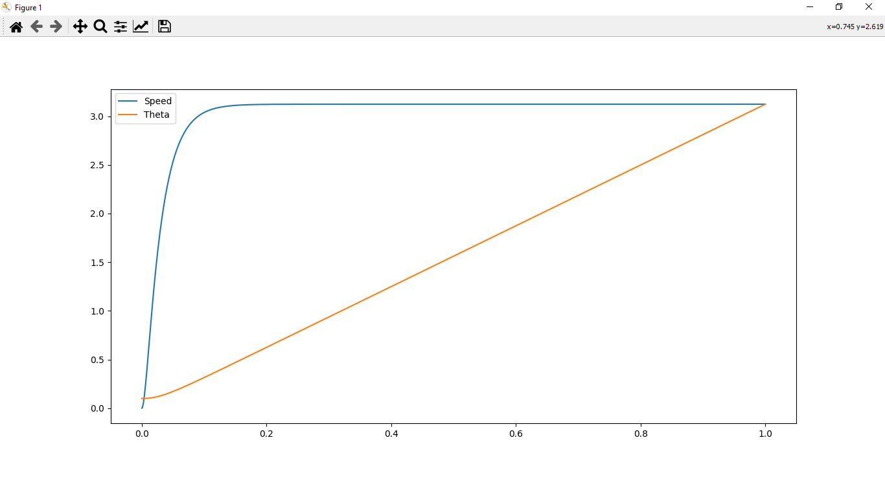
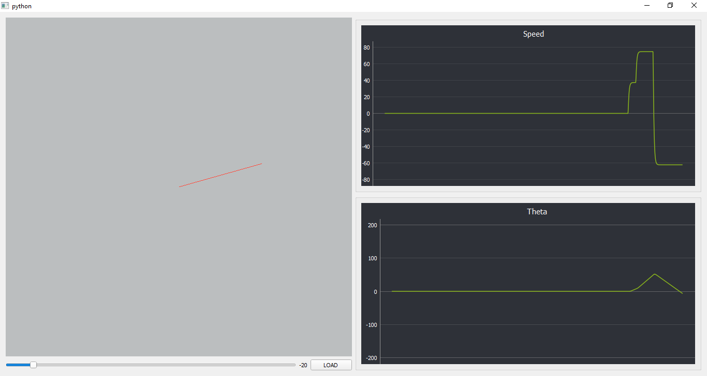

# DC Motor

## 1. Paramter

## 2. Equation of the motor speed

### 2.1 Math

### 2.2 Transfer function

### 2.3 Transfer function matlab simulink

## 3. Inverse Laplace

when Uin(t) = U*u(t)

### 3.1 The speeds when ⍵(t) = 0

### 3.2 The speeds when ϴ(t) = 0

### 3.3 Plot python

### 3.3 Simulation python
